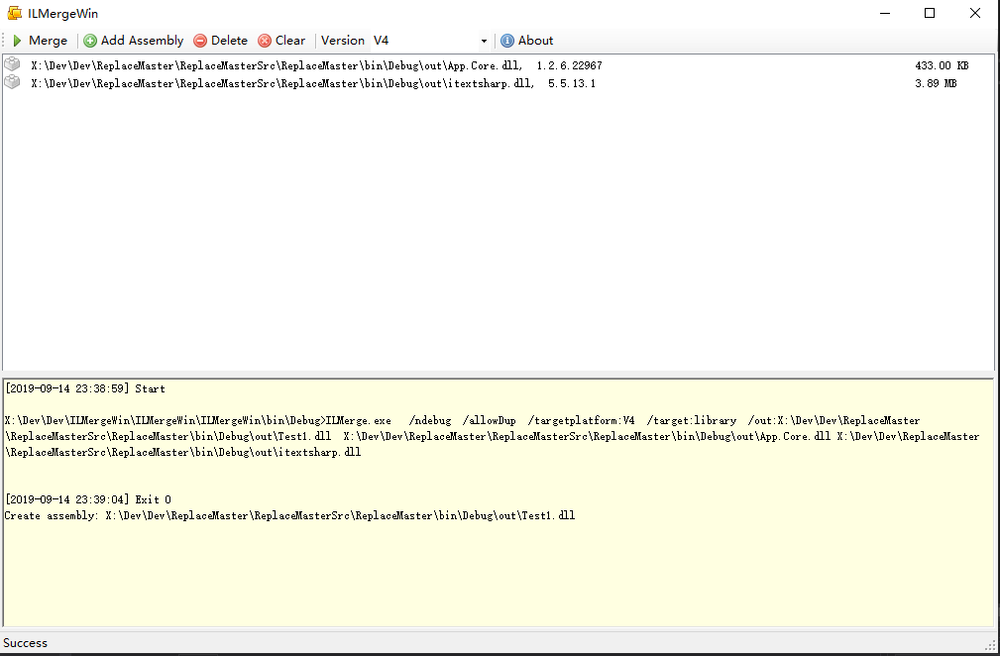

# ILMergeWin

- This tool can merge several assemblies into one assembly. 
- It's a windows form wrapper for ILMerge. 
- Notes: The tool can't run in network folder, because cmd.exe don't support UNC path.

# More
- Author: https://www.github.com/surfsky/ILMergeWin/

# History

- 1.0.0
    - [x] Select assemblies (Add, Delete, Clear).
    - [x] Merge assemblies.
    - [x] Show console output.
    - [x] Run in thread.
